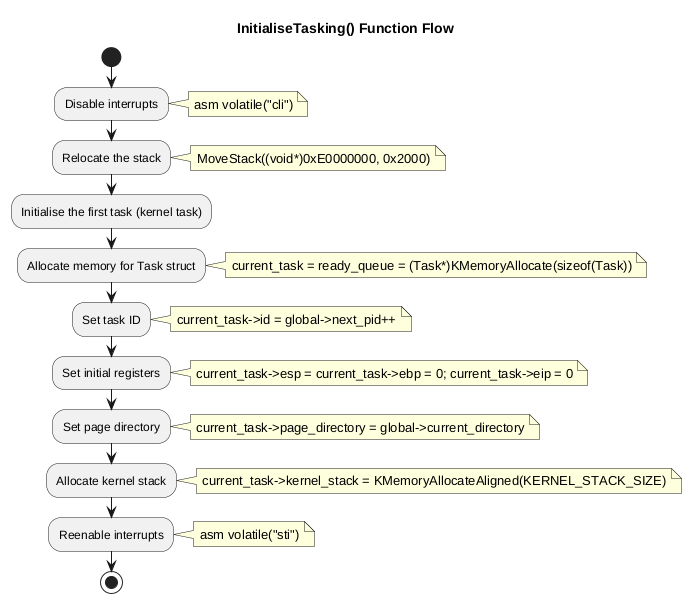
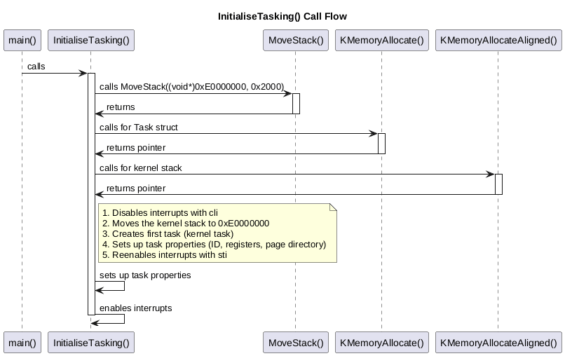

# InitialiseTasking() Function Flow

The `InitialiseTasking()` function is a critical part of the LittleKernel OS startup process. It initializes the tasking system by creating the first task (the kernel task) and setting up the necessary structures for process management.

## Function Location
- **File**: `kernel/LittleKernel/Task.cpp`
- **Called from**: `multiboot_main()` in `kernel/LittleKernel/main.cpp`

## Flow Diagrams

### Activity Flow


### Call Sequence


## Flow Sequence

### Step 1: Disable Interrupts
```cpp
asm volatile("cli");
```
- Disables all interrupts to prevent interruption during critical initialization

### Step 2: Relocate the Stack
```cpp
MoveStack((void*)0xE0000000, 0x2000);
```
- Moves the kernel stack to a known location (0xE0000000) with 8KB size
- This ensures the stack location is predictable for the tasking system

### Step 3: Initialize the First Task (Kernel Task)
```cpp
current_task = ready_queue = (Task*)KMemoryAllocate(sizeof(Task));
```
- Allocates memory for the first task structure
- Sets both current_task and ready_queue to point to this task
- This creates the initial kernel task

### Step 4: Set Task Properties
```cpp
current_task->id = global->next_pid++;
current_task->esp = current_task->ebp = 0;
current_task->eip = 0;
current_task->page_directory = global->current_directory;
current_task->kernel_stack = KMemoryAllocateAligned(KERNEL_STACK_SIZE);
```
- Assigns a unique process ID
- Sets initial register values (stack pointer and base pointer to 0, instruction pointer to 0)
- Sets the page directory to the current (kernel) directory
- Allocates an aligned kernel stack of 2KB

### Step 5: Re-enable Interrupts
```cpp
asm volatile("sti");
```
- Re-enables interrupts after initialization is complete

## Dependencies
- Uses `KMemoryAllocate()` for memory allocation
- Uses `KMemoryAllocateAligned()` for aligned kernel stack allocation
- Modifies global state in the `SVar` structure (`global->current_task`, `global->ready_queue`, etc.)

## Related Functions
- `MoveStack()` - Called internally to relocate the kernel stack
- `TaskSwitch()` - Will later be used for context switching
- `Fork()` - Will be used to create new processes