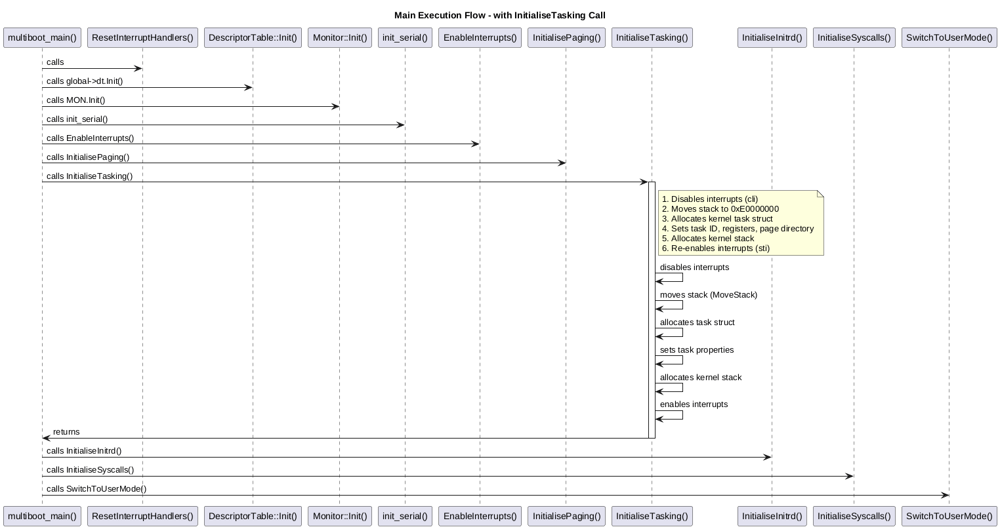

# LittleKernel Program Flow - InitialiseTasking() Focus

## Main Execution Flow

When the kernel boots via multiboot, execution begins with the `multiboot_main()` function in `kernel/LittleKernel/main.cpp`:



```
multiboot_main()
├── ResetInterruptHandlers()
├── global->dt.Init() (DescriptorTable initialization)
├── MON.Init() (Monitor initialization)
├── MON.Clear() 
├── init_serial() (Initialize serial port)
├── Find initrd location
├── InitLinkerVariables()
├── GenericWrite("Enabling interrupts")
├── EnableInterrupts()
├── GenericWrite("Enabling paging")
├── InitialisePaging()
├── GenericWrite("Initialising tasking")  ← This is where our focus is
├── InitialiseTasking() ← FOCUS OF THIS DOCUMENT
├── GenericWrite("Initialising initrd")
├── InitialiseInitrd()
├── GenericWrite("Initialising syscalls")
├── InitialiseSyscalls()
├── SwitchToUserMode()
├── syscall_MonitorWrite("Hello, user world!")
└── return 0xDEADABBA
```

## InitialiseTasking() Detailed Flow

### Entry Point
The call occurs in `main.cpp` line 33:
```cpp
GenericWrite("Initialising tasking\n");
InitialiseTasking();
```

### Within InitialiseTasking()
1. **Disable interrupts** - `asm volatile("cli");`
   - Prevents interruption during critical setup

2. **Relocate stack** - `MoveStack((void*)0xE0000000, 0x2000);`
   - Moves kernel stack to predictable location (0xE0000000)
   - Size: 0x2000 bytes (8KB)

3. **Create first task** - `(Task*)KMemoryAllocate(sizeof(Task));`
   - Allocates memory for initial kernel task
   - Sets both `current_task` and `ready_queue`

4. **Initialize task properties**:
   - `id`: Set to next available PID (starts at 1)
   - `esp/ebp`: Stack pointers set to 0 initially
   - `eip`: Instruction pointer set to 0
   - `page_directory`: Points to kernel's page directory
   - `kernel_stack`: Allocates 2KB aligned kernel stack
   - `next`: Set to NULL (only task in queue initially)

5. **Re-enable interrupts** - `asm volatile("sti");`
   - Allows interrupts after initialization complete

## Context in Complete Boot Process

The `InitialiseTasking()` call occurs after:
- Basic hardware initialization
- Memory management setup (heap and paging)
- Interrupt system initialization

And before:
- File system initialization
- System call setup
- Switching to user mode

This ordering is critical: the kernel needs memory management and interrupt handling in place before tasking can function properly.

## Memory Layout After InitialiseTasking()

After the function completes:
- Kernel stack relocated to 0xE0000000
- One task exists in system (ID=1, the kernel task)
- Task ready queue initialized with the kernel task
- Kernel-specific stack allocated at a different location
- Process ID counter incremented (next PID will be 2)

## Dependencies and Relationships

The function depends on:
- `KMemoryAllocate()` - for task structure allocation
- `KMemoryAllocateAligned()` - for kernel stack allocation
- `MoveStack()` - for stack relocation
- Global state in `SVar` structure

This function sets up the foundation for:
- `TaskSwitch()` - context switching between tasks
- `Fork()` - creating new processes
- `GetPid()` - getting current process ID